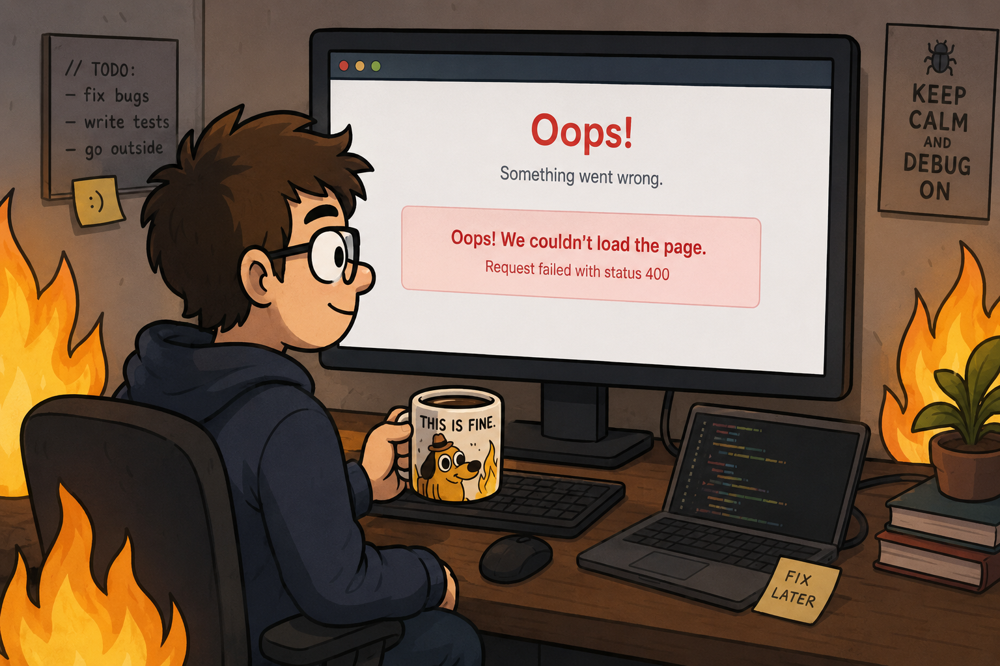

# Lab: The AI Made My Day 




## Introduction

You just joined a new team. A previous developer (with a little too much help from an AI assistant) built a small **Pokédex** app: it should fetch Pokémon from the public [PokéAPI](https://pokeapi.co/), show them as a grid of cards with pagination, and let you click any card to open a bigger detail card with that Pokémon's types, height, weight and base stats.

It almost works. The components are there, the logic looks reasonable… but two things are wrong, and your manager has noticed.

This lab is about two very real skills you will use every single day as a developer: **reading code you did not write**, and **debugging the gap between "the code looks fine" and "the product is broken."**

## The situation

Your manager did a quick review of the project and left you two pieces of feedback:

> **1. "The functionality looks correct, but I open the app and I don't see any Pokémon. The product is empty."**
>
> The data fetching logic is all there. The state, the loading flow, the error handling, it reads fine. And yet the screen never shows a single Pokémon. There is an error message on screen instead. Something small is preventing the data from ever arriving.

> **2. "These styles are really messy. There is no consistency here, every component does its own thing. This isn't readable and it definitely isn't scalable."**
>
> Some components are styled one way, others a completely different way, and one component mixes *both* approaches in the same file. Pick a single, coherent strategy and apply it across the app.

Your job is to fix both.

## Getting started

Install dependencies and run the development server:

```bash
npm install
npm run dev
```

Open [http://localhost:3000](http://localhost:3000) in your browser. You should see the **Pokédex** title, and an error box where the Pokémon grid should be. That is expected, it is part of what you are fixing.

## What you will fix

1. **The broken data fetch.** Figure out why the request to the PokéAPI never returns any Pokémon, and fix it so the grid renders.
2. **The inconsistent styling.** The app currently styles components in more than one way. Choose one approach and make the whole app consistent.

---

## Part 1: Make the Pokémon appear

The app fetches a page of Pokémon when it loads and stores them in state. If the request fails, it catches the error and shows it on screen, which is exactly what is happening right now.

**Step 1.** Run the app and read the error message on the page. It comes straight from the fetch. What status is the request returning?

**Step 2.** Open the browser DevTools, go to the **Network** tab, reload, and find the failing request. Look closely at the **URL** it is calling. Compare it against the real PokéAPI documentation: <https://pokeapi.co/docs/v2#pokemon>.

**Step 3.** Find where that URL is defined in the codebase and fix it. (Hint: start in `app/lib/pokeapi.js`.)

**Step 4.** Reload. The grid of Pokémon should now render, pagination should work, and clicking a card should open its detail view.

> 💡 The surrounding logic does **not** seem to need changes, resist the urge to rewrite the fetching code.

## Part 2: Clean up the styling

Right now the project uses **inconsistent styling approaches** across components:

- One component uses **CSS Modules** (`.module.css` files).
- Another uses **inline `style={{ }}` objects** for everything.
- Another **mixes both** in the same file.

This works in the browser, but it is exactly the kind of thing that makes a codebase hard to read and maintain.

**Step 1.** Open each file in `app/` and `app/components/` and identify *how* each one is styled. Make a quick list.

**Step 2.** Pick **one** strategy for the whole app. CSS Modules is a great choice for this project, it keeps styles scoped, readable, and out of your JSX. (If your class wants to teach a different approach, follow your instructor's guidance.)

**Step 3.** Refactor every component so it uses that single approach consistently. Move inline styles into `.module.css` files, give the classes meaningful names, and remove the now-unused inline `style` objects.

**Step 4.** Make sure the app still looks and behaves the same after your refactor, same layout, same colors, same hover effects. You are changing *how* the styles are written, not *what* they look like.

## Part 3: Check your work

Go through this checklist before you consider the lab done:

- [ ] The Pokémon grid renders on first load (no error box)
- [ ] Pagination (Previous / Next) loads different Pokémon
- [ ] Clicking a card opens the detail view with image, types, height, weight and stats
- [ ] Closing the detail view works (the × button or clicking the backdrop)
- [ ] Every component uses **the same** styling approach, no leftover inline `style={{ }}` objects (or whichever single approach you chose)
- [ ] No console errors

## Iteration

Once both problems are fixed, push it further:

- Add a **type badge color map** so each Pokémon type has its own color instead of all-red badges.
- Add a small **loading skeleton** for the cards instead of the plain "Loading…" text.
- Show the Pokémon **id** padded to three digits (e.g. `#025`).
- Add a search input that filters the current page by name (remember: lift the state up).
- Persist the current page in the URL so a refresh keeps you on the same page.

## Key concepts to review

- **Reading the Network tab**: every failed request tells you the exact URL and status code.
- **`fetch` and `response.ok`**: why a "successful" `fetch` can still represent a failed request.
- **CSS Modules vs inline styles**: [Next.js CSS docs](https://nextjs.org/docs/app/getting-started/css), scoping, readability and consistency.
- **Consistency as a feature**: a coherent codebase is easier to read, review and extend than a clever one.
